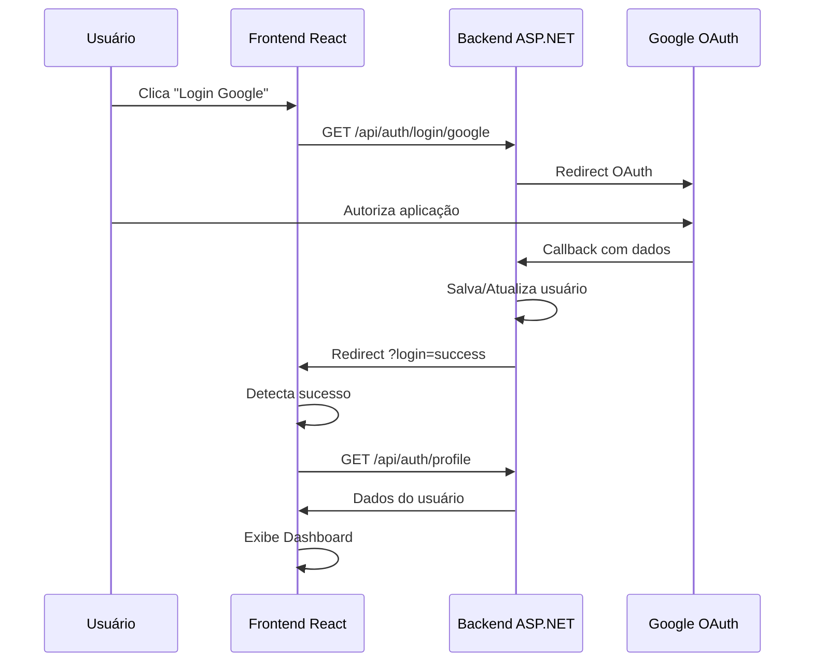

# 🚀 Integração Frontend-Backend Completa - YourStreet

## ✅ **Implementação Realizada**

### 🎯 **Backend (ASP.NET Core)**
- ✅ Google OAuth configurado
- ✅ AuthController com endpoints `/login/google`, `/callback/google`, `/logout`, `/profile`
- ✅ Modelo User com dados do Google
- ✅ CORS configurado para frontend
- ✅ Redirecionamento após login

### 🎯 **Frontend (React + TypeScript)**
- ✅ AuthService para gerenciar autenticação
- ✅ Hook useAuth para estado global
- ✅ Dashboard pós-login
- ✅ Tela de loading
- ✅ Integração com backend

---

## 🔧 **Como Testar**

### 1️⃣ **Iniciar Backend**
```bash
cd backend/your-street-server
dotnet run --launch-profile https
```
- ✅ Backend rodará em `https://localhost:7027`

### 2️⃣ **Iniciar Frontend** 
```bash
cd frontend
npm run dev
```
- ✅ Frontend rodará em `http://localhost:5173`

### 3️⃣ **Fluxo de Login**
1. Acesse `http://localhost:5173`
2. Clique em "Continuar com Google"
3. Será redirecionado para OAuth do Google
4. Após autorizar, volta para `http://localhost:5173?login=success`
5. Dashboard carrega automaticamente

---

## 🔄 **Arquitetura da Integração**



---

## 📁 **Arquivos Principais**

### **Backend**
- `Controllers/AuthController.cs` - Endpoints de autenticação
- `Models/User.cs` - Modelo de usuário
- `Program.cs` - Configuração OAuth + CORS
- `appsettings.Development.json` - Credenciais Google

### **Frontend**
- `services/AuthService.ts` - Serviço de autenticação  
- `hooks/useAuth.ts` - Hook de estado global
- `app/App.tsx` - Roteamento login/dashboard
- `app/components/Dashboard.tsx` - Tela pós-login
- `.env` - URL da API

---

## 🔐 **Credenciais Google OAuth**

**Client ID**: `242001008359-84nva306jkuv1jm5m4hl5c76erii950v.apps.googleusercontent.com`

⚠️ **Para produção**, altere as credenciais no Google Console e appsettings.json

---

## ⚡ **Recursos Implementados**

### ✅ **Autenticação Completa**
- Login com Google OAuth
- Persistência de sessão (cookies)
- Logout funcional
- Estado de loading

### ✅ **Frontend Responsivo**
- Dashboard moderna
- Header com perfil do usuário
- Cards de funcionalidades
- Estatísticas básicas

### ✅ **Integração Robusta**
- CORS configurado corretamente
- Tratamento de erros
- Redirecionamento automático
- Estado persistente

---

## 🎯 **Próximos Passos**

1. **Funcionalidades do Mapa**
   - Integração com MapBox/Google Maps
   - CRUD de ocorrências

2. **Sistema de Comentários**
   - API de comentários
   - Notificações

3. **Upload de Imagens**
   - Cloudinary/AWS S3
   - Gerenciamento de mídia

4. **Geolocalização**
   - Permissões do navegador
   - Endereçamento automático